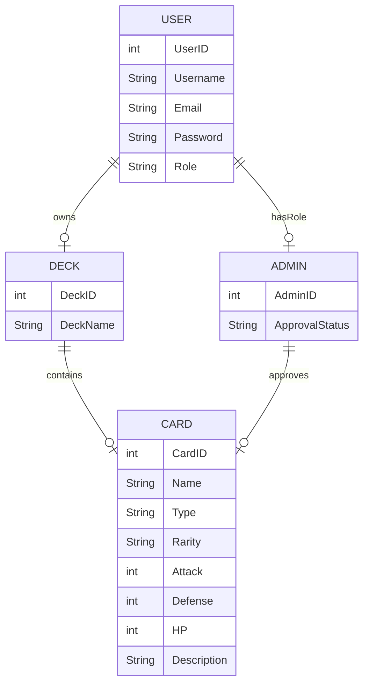
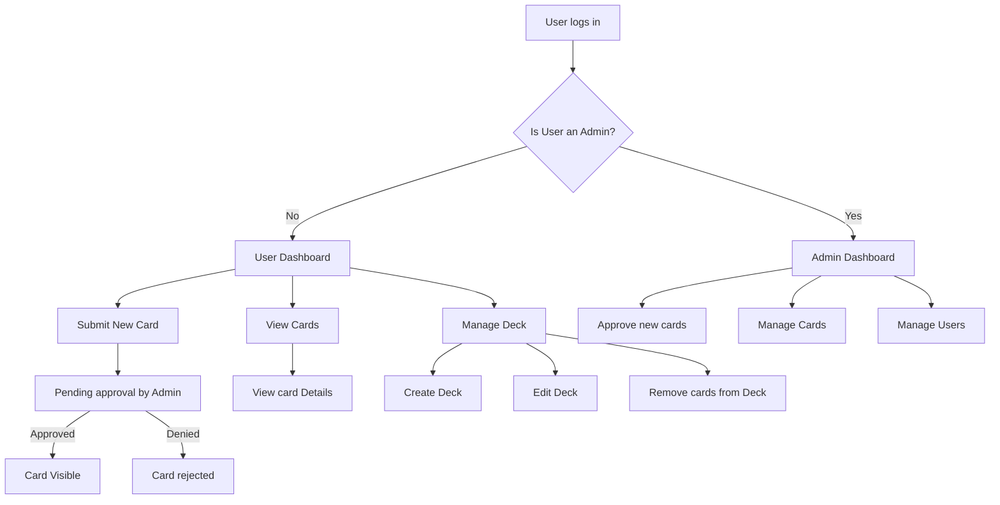
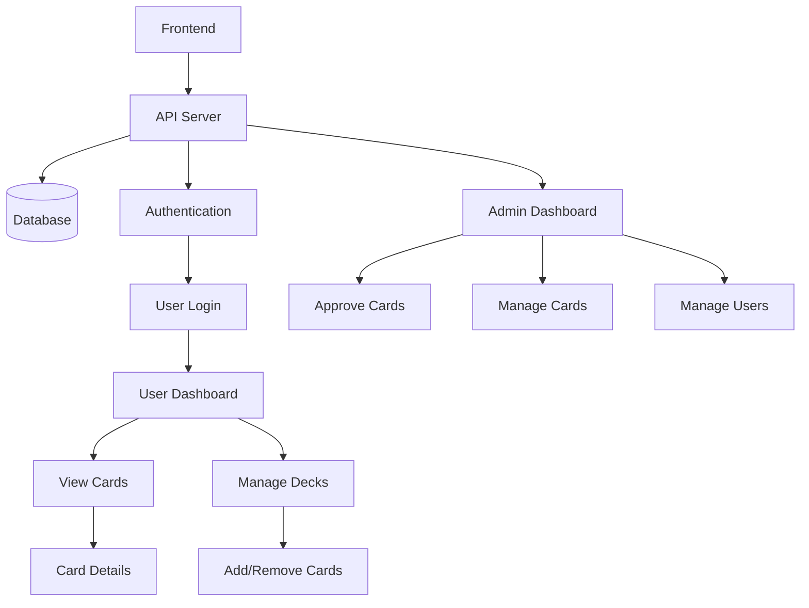
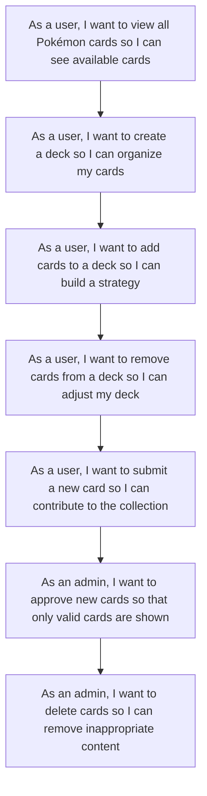
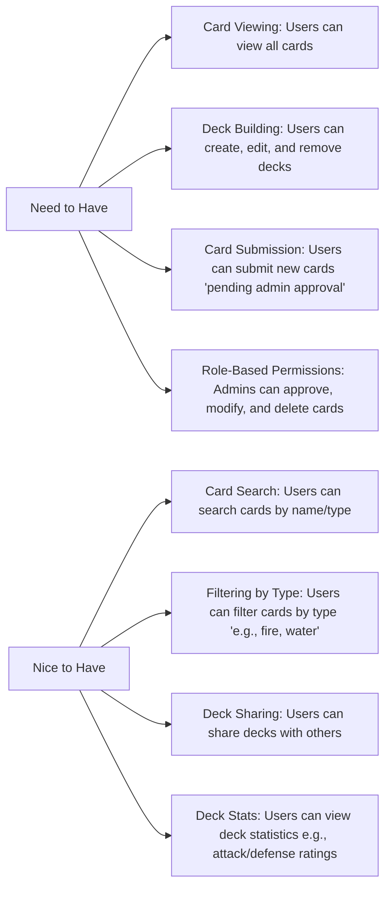

# Pokemon Card Storage Web App - Planning & Documentation

This document outlines the planning and design for the **Pokémon Card Storage Web App**,
using mermaid diagrams and markdown to represent key components of the system.

## Entity-Relationship Diagram (ERD)

## User Flow Diagram

## System Architecture Diagram

## API Endpoints Table

## API Endpoints Table

| Endpoint                         | HTTP Method | Description                                  | Authentication/Authorization |
|----------------------------------|-------------|----------------------------------------------|------------------------------|
| `/cards`                         | GET         | Fetch all available cards                    | Public (No authentication)   |
| `/cards`                         | POST        | Submit a new card (pending admin approval)   | Authenticated (User Role)    |
| `/cards/{id}`                    | PUT         | Update card details (admin only)             | Authenticated (Admin Role)   |
| `/cards/{id}`                    | DELETE      | Delete a card (admin only)                   | Authenticated (Admin Role)   |
| `/decks`                         | GET         | Fetch all decks for the logged-in user       | Authenticated (User Role)    |
| `/decks`                         | POST        | Create a new deck                           | Authenticated (User Role)    |
| `/decks/{deckId}`                | PUT         | Edit a deck                                 | Authenticated (User Role)    |
| `/decks/{deckId}/cards`          | POST        | Add a card to a deck                        | Authenticated (User Role)    |
| `/decks/{deckId}/cards/{id}`     | DELETE      | Remove a card from a deck                   | Authenticated (Admin Role)   |

## User Strories

## Requirement List

